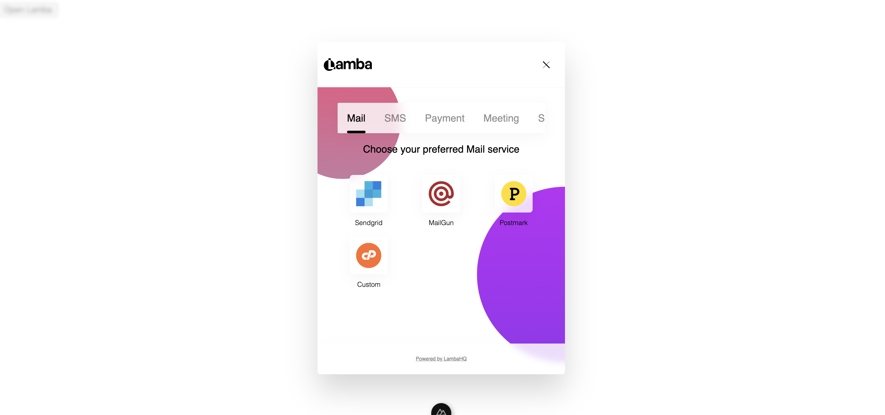

<!--
Get your module up and running quickly.

Find and replace all on all files (CMD+SHIFT+F):
- Name: Lamba
- Package name: @lambahq/nuxt
- Description: Lamba's official Nuxt module

PUBLISHING UPDATES TO THIS MODULE
---------------------------------

Publishing updates to an npm package, whether it's under your personal account or an organization, follows a specific process to ensure that the new version is correctly distributed to users. Here’s a step-by-step guide to update your Nuxt module or any npm package:

### Step 1: Make Your Changes

First, implement the changes you want in your package. This could involve fixing bugs, adding features, or improving documentation.

### Step 2: Update the Version Number

Before you publish your update, you need to update the version number in your `package.json` file. npm uses [semantic versioning](https://semver.org/) (semver), which consists of three numbers in the format of `MAJOR.MINOR.PATCH` (e.g., `1.0.0`). Here's how to update your version:

- **Patch release (`1.0.1`)**: Backwards compatible bug fixes.
- **Minor release (`1.1.0`)**: Add functionality in a backwards compatible manner.
- **Major release (`2.0.0`)**: Make incompatible API changes.

You can manually update the version in your `package.json` or use the npm version command to update it automatically:

```bash
npm version patch # for a patch update
npm version minor # for a minor update
npm version major # for a major update
```

This command updates the version number in your `package.json` file and creates a git tag for this release if your project is a git repository.

### Step 3: Publish the Update

After updating the version number, you can publish the update to npm. Make sure you are logged in to npm with the account or organization under which the package is published:

```bash
npm login
```

Then, run the publish command:

```bash
npm publish
```

If your package is scoped under an organization and you're publishing a public update, ensure to include the `--access public` flag if it's not set by default in your `package.json`:

```bash
npm publish --access public
```

### Step 4: Verify the Publication

After publishing, verify that your update is live:

- You can check the npm website for your package's page to see if the new version is listed.
- Alternatively, run `npm view <package-name> versions` to see all the versions of your package, including the one you just published.

### Additional Tips

- **Testing**: Always thoroughly test your package before publishing an update to ensure that it works as expected and is backward compatible (for minor and patch updates).
- **Documentation**: Update your `README.md` and any other relevant documentation to reflect the changes in the new version.
- **Deprecation**: If you're making significant changes that deprecate previous functionality, make sure to communicate these changes clearly in your documentation and change logs.
- **npm deprecate**: For versions that you no longer support or recommend, you can use the `npm deprecate` command to warn users when they install or upgrade to deprecated versions of your package.

Following these steps will help you manage and publish updates to your npm package efficiently, ensuring your users have access to the latest features and fixes.
-->

# Lamba

[![npm version][npm-version-src]][npm-version-href]
[![npm downloads][npm-downloads-src]][npm-downloads-href]
[![License][license-src]][license-href]

Integrate the Lamba client library in your nuxt project to start using low code capabilities in your web apps.

## Previews

<p align="center">
  
</p>

## Features

<!-- Highlight some of the features your module provide here -->
- ⛰ &nbsp;Embed low code capabilities
- 🚠 &nbsp;Same configuration & doc as the CDN version
- 🌲 &nbsp;Enjoy light and dark theme
- 👩‍🎨 &nbsp;Responsive & mobile friendly UI

## Quick Setup

1. Add `@lambahq/nuxt` dependency to your project

```bash
# Using pnpm
pnpm add -D @lambahq/nuxt

# Using yarn
yarn add --dev @lambahq/nuxt

# Using npm
npm install --save-dev @lambahq/nuxt
```

2. Add `@lambahq/nuxt` to the `modules` section of `nuxt.config.ts` and setup the runtimeConfig as shown below:

```js
export default defineNuxtConfig({
  ssr: false, // REQUIRED
  modules: [
    '@lambahq/nuxt'
  ]
})
```

## Usage
```js
import { useNuxtApp } from '#app';
const nuxtApp = useNuxtApp();

const openLamba = ()=>{
  const config = {
    title: "Lamba",
    theme: "light",
    appId: "65aabeba6182d6903a2ea355",
    customerId: "cus_x1847",
  };

  const lamba = nuxtApp.$lamba(config);

  // listening for events
  lamba.on("name_of_the_event",(data)=>{
    console.log(data);
  })
}
```

That's it! You can now use Lamba in your Nuxt app ✨

<!-- Badges -->
[npm-version-src]: https://img.shields.io/npm/v/@lambahq/nuxt/latest.svg?style=flat&colorA=18181B&colorB=28CF8D
[npm-version-href]: https://www.npmjs.com/package/@lambahq/nuxt

[npm-downloads-src]: https://img.shields.io/npm/dt/@lambahq/nuxt.svg?style=flat&colorA=18181B&colorB=28CF8D
[npm-downloads-href]: https://npmjs.com/package/@lambahq/nuxt

[license-src]: https://img.shields.io/npm/l/@lambahq/nuxt.svg?style=flat&colorA=18181B&colorB=28CF8D
[license-href]: https://www.npmjs.com/package/@lambahq/nuxt
